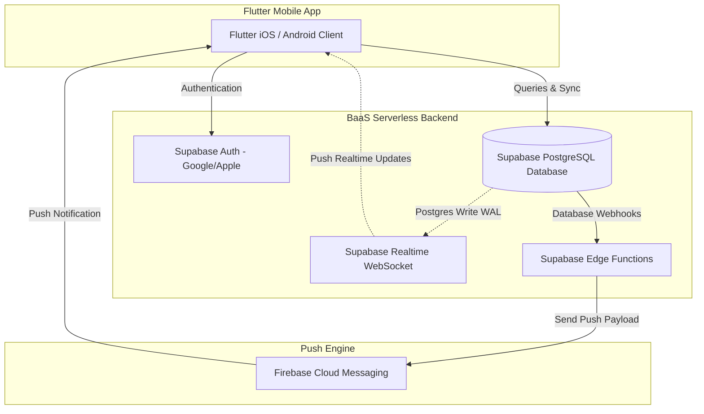

# MVP DEVELOPMENT PLAN - EMORA
**Phiên bản:** 1.0 (Production Draft)  
**Tác giả:** Senior Product Manager, Solution Architect & Tech Lead  
**Ngày lập:** 11/06/2026  
**Dự án:** Emora - Ứng dụng Kết nối và Thấu hiểu Cặp đôi (Phase 1 MVP)  

---

## 1. Phân tích chức năng chi tiết (Feature Specifications)

### 1.1 Couple Connection (Ghép đôi thiết bị)
*   **Mục tiêu:** Kết nối hai tài khoản người dùng riêng biệt thành một thực thể "cặp đôi" (`couple`) duy nhất để đồng bộ hóa và bảo mật dữ liệu hai người.
*   **User Flow:**  
    1. Người dùng A đăng nhập -> Hệ thống phát hiện chưa kết nối -> Chuyển đến màn hình Pairing.
    2. Người dùng A chọn "Tạo mã ghép đôi" -> Hệ thống sinh mã 6 số ngẫu nhiên kèm mã QR Code tương ứng.
    3. Người dùng A bấm "Gửi lời mời nhanh" -> Hệ thống chia sẻ deep link mời qua Zalo/Messenger.
    4. Người dùng B mở link -> Ứng dụng Emora tự động kích hoạt -> Báo nhận yêu cầu kết nối từ Người dùng A -> Người dùng B bấm "Đồng ý" -> Kết nối thành công -> Chuyển về Dashboard.
*   **Màn hình liên quan:** Splash Screen, Login Screen, Pairing Screen.
*   **Bảng Database cần thiết:** `users`, `couples`, `pairing_codes`.
*   **Backend Logic / API:**
    *   `generate_pairing_code()`: Tạo mã 6 chữ số duy nhất, ghi nhận thời gian hết hạn (15 phút), lưu vào bảng `pairing_codes`.
    *   `confirm_pairing(code)`: So khớp mã nhập vào. Nếu hợp lệ, tạo dòng mới trong `couples`, cập nhật cột `partner_id` ở bảng `users` cho cả hai người, đổi trạng thái sang `Connected`, đồng thời xóa mã ghép đôi đã dùng.
    *   `disconnect_couple()`: Hủy kết nối giữa hai người, chuyển `status` của couple sang `Disconnected`, xóa trường `partner_id` trong hồ sơ `users` (dữ liệu cũ lưu lại 30 ngày theo chính sách GDPR trước khi xóa hẳn).
*   **Edge Cases:**
    *   *Mã ghép đôi hết hạn (quá 15 phút):* Hệ thống báo lỗi, tự động sinh mã mới.
    *   *Người dùng tự nhập mã của chính mình:* Hệ thống kiểm tra trùng ID người tạo và báo lỗi.
    *   *Người dùng nhập mã ghép đôi khi đối phương đã kết nối với người khác:* Hệ thống báo mã không còn hiệu lực.
*   **Acceptance Criteria (Tiêu chí Nghiệm thu):**
    *   Thời gian tạo mã và tạo mã QR dưới 500ms.
    *   Thao tác kết nối thành công qua việc click link hoặc quét mã QR phản hồi cập nhật tức thì (realtime sync) màn hình của cả hai thiết bị dưới 1.5 giây.

### 1.2 Mood Sharing (Chia sẻ Cảm xúc)
*   **Mục tiêu:** Cho phép người dùng chia sẻ tâm trạng tức thời chỉ qua 1 chạm trực tiếp trên Dashboard mà không cần soạn tin nhắn văn bản.
*   **User Flow:**  
    1. Người dùng chạm vào **Hero Bubble** trên Dashboard -> Mở ra bánh xe cảm xúc (Mood Wheel) gồm 6 trạng thái cốt lõi kèm biểu tượng hoạt hình sinh động.
    2. Người dùng chạm chọn một cảm xúc (ví dụ: `😫 Tired` hoặc `😡 Irritated`) -> Bánh xe đóng lại.
    3. Bong bóng Hero Bubble của người dùng đổi màu tương ứng; đồng thời bong bóng của đối phương đổi màu realtime kèm theo thông báo đẩy nhẹ nhàng.
*   **Màn hình liên quan:** Dashboard Screen.
*   **Bảng Database cần thiết:** `users` (cột `current_mood`, `mood_updated_at`), `mood_history` (dành cho Premium hoặc thống kê Phase sau nếu cần, MVP chỉ cần cập nhật trạng thái trực tiếp trên table `users` để tối giản hóa).
*   **Backend Logic / API:**
    *   `update_user_mood(mood_type)`: Cập nhật trường `current_mood` và `mood_updated_at` trong bảng `users` của người gọi. Supabase Realtime tự động truyền tín hiệu thay đổi đến thiết bị của partner đang lắng nghe table `users` thông qua filter `id = partner_id`.
*   **Edge Cases:**
    *   *Người dùng spam cập nhật mood liên tục:* Áp dụng rate limit ở phía client (chặn đổi mood liên tiếp trong vòng 10 giây).
    *   *Mất kết nối mạng:* Trạng thái mới được lưu tạm ở Local Database (SQLite/Cache) và tự động sync lên Supabase khi có internet.
*   **Acceptance Criteria:**
    *   Điện thoại của partner nhận được màu sắc cập nhật mới của đối phương dưới 1.5 giây qua kênh WebSocket realtime.

### 1.3 Cycle Tracking (Theo dõi Chu kỳ)
*   **Mục tiêu:** Giúp bạn nữ dễ dàng ghi nhật ký chu kỳ kinh nguyệt và giúp bạn nam thấu hiểu trạng thái sức khỏe/tâm lý của bạn nữ một cách tinh tế nhất mà không làm mất tính riêng tư.
*   **User Flow:**  
    1. Bạn nữ chọn màn hình Calendar -> Bấm chọn ngày bắt đầu hoặc ngày kết thúc kỳ kinh bằng thao tác chạm trực quan.
    2. Hệ thống tính toán độ dài chu kỳ trung bình, dự báo kỳ tiếp theo, ngày rụng trứng và cửa sổ dễ thụ thai.
    3. Trạng thái chu kỳ ở mức tổng quát (e.g. `PMS`, `Kỳ kinh nguyệt`, `Cửa sổ thụ thai`) được đồng bộ hiển thị lên máy bạn nam theo đúng thiết lập riêng tư của bạn nữ.
*   **Màn hình liên quan:** Calendar Screen, Settings Screen (Privacy).
*   **Bảng Database cần thiết:** `period_logs`, `cycle_settings`.
*   **Backend Logic / API:**
    *   `get_period_history()`: Trả về danh sách ngày hành kinh đã lưu.
    *   `save_period_date(start_date, end_date)`: Lưu dữ liệu chu kỳ mới.
    *   `calculate_cycle_prediction(user_id)`: Thuật toán (chạy trực tiếp ở client hoặc qua database view để tiết kiệm chi phí serverless function) dự đoán chu kỳ tiếp theo dựa trên trung bình 3 tháng gần nhất.
*   **Edge Cases:**
    *   *Không đủ dữ liệu lịch sử:* Trong 3 tháng đầu, hệ thống lấy độ dài chu kỳ mặc định là 28 ngày và kỳ kinh là 5 ngày để tính toán.
    *   *Bạn nữ tắt chia sẻ:* Máy bạn nam không hiển thị bất kỳ thông tin nào về chu kỳ trên Dashboard hay Calendar ngoài thông báo: *"Chế độ riêng tư đang bật"*.
*   **Acceptance Criteria:**
    *   Ghi nhận dữ liệu chu kỳ chỉ trong 2 lần chạm (chọn ngày bắt đầu và kết thúc).
    *   Bạn nam hoàn toàn không xem được dữ liệu chi tiết của từng ngày ghi chép mà chỉ thấy thông báo giai đoạn vĩ mô.

### 1.4 Shared Journal (Nhật ký dùng chung)
*   **Mục tiêu:** Lưu trữ thông tin sinh hoạt sức khỏe sinh sản dùng chung một cách tự nhiên, không rườm rà.
*   **User Flow:**  
    1. Một trong hai người chạm vào một ngày trên Calendar -> Chọn "Thêm nhật ký quan hệ".
    2. Chọn hình thức: `🛡 Có bảo vệ` hoặc `⚠️ Không bảo vệ`, điền thêm ghi chú ngắn (tùy chọn) -> Nhấn Lưu.
    3. Dữ liệu đồng bộ trực tiếp lên lịch của cả hai người. Phía đối phương nhận được thông báo đẩy nhẹ nhàng để cập nhật thông tin.
*   **Màn hình liên quan:** Calendar Screen, Journal Detail Sheet.
*   **Bảng Database cần thiết:** `relations_journal`.
*   **Backend Logic / API:**
    *   `add_journal_entry(date, type, notes)`: Tạo bản ghi nhật ký.
    *   `update_journal_entry(entry_id, type, notes)`: Sửa bản ghi.
    *   `delete_journal_entry(entry_id)`: Xóa bản ghi.
*   **Edge Cases:**
    *   *Xung đột ghi chép (hai người tạo cùng lúc cho một ngày):* Sử dụng khóa duy nhất (composite unique key) gồm `couple_id` và `relation_date` trong database để ngăn chặn trùng lặp, dòng lệnh sau cùng sẽ thực hiện `UPSERT` (cập nhật đè).
*   **Acceptance Criteria:**
    *   Loại bỏ hoàn toàn cơ chế xác nhận "Pending-Confirm-Reject" để giảm gượng gạo giao tiếp.
    *   Đồng bộ hiển thị tức thì trên cả 2 máy khi có thay đổi.

### 1.5 Care Requests (Yêu cầu Chăm sóc)
*   **Mục tiêu:** Gửi yêu cầu hỗ trợ thực tế (việc nhà, chăm con, cái ôm...) chỉ với 1 chạm nhanh từ Dashboard.
*   **User Flow:**  
    1. Người dùng nhấn giữ **Hero Bubble** trên Dashboard -> Bảng 6 templates Care Requests xuất hiện.
    2. Chọn 1 request (e.g. `👶 Trông con giúp em` hoặc `☕ Mang cho em ly nước`) -> Nhấn gửi.
    3. Đối phương nhận push notification dạng Actionable -> Bấm "Chấp nhận" ngay trên notification -> Trạng thái đổi thành `Accepted` -> Khi hoàn thành việc, bấm "Hoàn thành" -> Đối phương nhận thông báo việc đã xong.
*   **Màn hình liên quan:** Dashboard Screen, Care Requests Bottom-sheet.
*   **Bảng Database cần thiết:** `care_requests`.
*   **Backend Logic / API:**
    *   `create_care_request(template_id)`: Tạo yêu cầu mới với status là `Pending`.
    *   `update_request_status(request_id, new_status)`: Cập nhật trạng thái (`Pending` -> `Accepted` -> `Completed`/`Canceled`).
*   **Edge Cases:**
    *   *Yêu cầu quá lâu không xử lý:* Các request có trạng thái `Pending` quá 24h tự động được chuyển sang trạng thái ẩn (Archived) để làm sạch giao diện.
    *   *Hủy nhận việc:* Người nhận đã bấm Chấp nhận nhưng bận đột xuất có thể bấm Hủy để đưa trạng thái về lại `Pending` kèm thông báo cho người gửi.
*   **Acceptance Criteria:**
    *   Gửi và nhận cập nhật trạng thái realtime trong vòng dưới 1.5 giây.
    *   Nút "Chấp nhận" và "Hoàn thành" hiển thị trực quan, bấm chạy được ngay trên Notification khóa màn hình.

### 1.6 Notifications (Thông báo Đẩy)
*   **Mục tiêu:** Cung cấp cầu nối liên lạc tức thì cho mọi hoạt động của cặp đôi khi không mở app.
*   **User Flow:**  
    1. User A đổi mood hoặc gửi Care Request -> Hệ thống phát hiện thiết bị của User B đang tắt app.
    2. Supabase Database Webhook kích hoạt gửi event sang Supabase Edge Function -> Gọi Firebase Cloud Messaging (FCM) API gửi push.
    3. Điện thoại User B nhận thông báo đẩy tức thì.
*   **Màn hình liên quan:** Toàn bộ hệ thống thông báo của hệ điều hành.
*   **Bảng Database cần thiết:** `user_devices`.
*   **Backend Logic / API:**
    *   `register_device(token, platform)`: Lưu token của thiết bị khi user mở app và cấp quyền push.
    *   `send_push_to_partner(user_id, title, body, payload)`: Gửi push thông qua Edge Function.
*   **Edge Cases:**
    *   *User đăng xuất hoặc cài lại app:* Token cũ cần được xóa hoặc cập nhật đè để tránh gửi push rác.
*   **Acceptance Criteria:**
    *   Thời gian nhận Push Notification dưới 5 giây kể từ khi sự kiện xảy ra trên database.

---

## 2. Đề xuất Kiến trúc MVP tối ưu (Solution Architecture)

Để đảm bảo các tiêu chí: **1 Developer triển khai, Chi phí vận hành tối đa xấp xỉ $0, Dễ phát triển và Dễ mở rộng**, chúng tôi đề xuất kiến trúc **BaaS (Backend-as-a-Service) Serverless hoàn toàn dựa trên Supabase và Firebase**:



### Tại sao chọn kiến trúc này?
1.  **Supabase Realtime (Không cần viết code WebSocket):** Supabase tự động lắng nghe những thay đổi (INSERT/UPDATE/DELETE) ở tầng PostgreSQL Write-Ahead Log (WAL) và truyền tải dữ liệu realtime đến Flutter client qua kênh WebSocket có sẵn. Lập trình viên không cần viết, duy trì hay scale server Socket.io/NestJS.
2.  **Supabase Row-Level Security (RLS) để Bảo mật Quyền riêng tư:** Postgres RLS cho phép viết các điều kiện bảo mật trực tiếp trên Database. Ví dụ: *"Người dùng chỉ được đọc/ghi dữ liệu khi dòng đó thuộc về `couple_id` của chính họ"*. Điều này đảm bảo an toàn dữ liệu y tế/nhạy cảm tuyệt đối mà không cần qua tầng API trung gian.
3.  **Firebase Cloud Messaging (FCM) miễn phí:** Đóng vai trò là push engine duy nhất gửi thông báo đến thiết bị di động Android và iOS.
4.  **Supabase Edge Functions:** Viết bằng TypeScript chạy trên môi trường Deno cực nhanh và nhẹ, tự động kích hoạt thông qua Database Webhook để xử lý tác vụ gửi Push Notification hoặc tính toán dự đoán chu kỳ định kỳ. Chi phí chạy hoàn toàn miễn phí dưới ngưỡng 2 triệu lượt gọi/tháng.

---

## 3. Tech Stack cuối cùng

| Thành phần | Công nghệ lựa chọn | Ghi chú |
| :--- | :--- | :--- |
| **Cross-Platform Mobile** | Flutter SDK (mới nhất) | 1 source code chạy mượt mà trên iOS và Android. |
| **State Management** | `flutter_bloc` & `hydrated_bloc` | Đảm bảo quản lý state có cấu trúc tốt, hỗ trợ offline cache giao diện cực tốt. |
| **Local Database / Cache** | `shared_preferences` & `secure_storage` | Lưu trữ cấu hình theme, session token và dữ liệu đệm. |
| **Authentication** | Supabase Auth | Hỗ trợ Google Sign-in & Sign-in with Apple gốc. |
| **Database & Realtime** | Supabase PostgreSQL | Cơ sở dữ liệu quan hệ tối ưu cho dữ liệu chu kỳ và nhật ký dùng chung. |
| **Edge Logic / Cron-jobs** | Supabase Edge Functions (Deno) | Viết bằng TypeScript, không cần bảo trì hạ tầng server. |
| **Push Notification** | Firebase Cloud Messaging (FCM) | Kết hợp thư viện `flutter_local_notifications` của client. |
| **Tương tác vật lý** | `shake` & `vibration` package | Lắng nghe cảm biến gia tốc thiết bị phục vụ tính năng "Appreciation Shake". |

---

## 4. Thiết kế Chi tiết Kỹ thuật (Technical Design)

### 4.1 Database Schema (SQL DDL)

Dưới đây là cấu trúc bảng hoàn chỉnh bao gồm các chính sách bảo mật Row-Level Security (RLS) của PostgreSQL:

```sql
-- Kích hoạt extension hỗ trợ UUID sinh tự động
CREATE EXTENSION IF NOT EXISTS "uuid-ossp";

-- 1. BẢNG COUPLES (Cặp đôi)
CREATE TABLE couples (
    id UUID PRIMARY KEY DEFAULT uuid_generate_v4(),
    user_a_id UUID NOT NULL,
    user_b_id UUID,
    status VARCHAR(20) DEFAULT 'Pending' CHECK (status IN ('Pending', 'Connected', 'Disconnected')),
    created_at TIMESTAMP WITH TIME ZONE DEFAULT TIMEZONE('utc'::text, NOW()) NOT NULL
);

-- 2. BẢNG USERS (Mở rộng từ bảng auth.users mặc định của Supabase)
CREATE TABLE users (
    id UUID PRIMARY KEY REFERENCES auth.users(id) ON DELETE CASCADE,
    email VARCHAR(255) NOT NULL,
    partner_id UUID REFERENCES users(id) ON DELETE SET NULL,
    couple_id UUID REFERENCES couples(id) ON DELETE SET NULL,
    current_mood VARCHAR(20) DEFAULT 'Calm',
    mood_updated_at TIMESTAMP WITH TIME ZONE DEFAULT TIMEZONE('utc'::text, NOW()),
    created_at TIMESTAMP WITH TIME ZONE DEFAULT TIMEZONE('utc'::text, NOW()) NOT NULL
);

-- 3. BẢNG PAIRING CODES (Mã kết nối tạm thời)
CREATE TABLE pairing_codes (
    id UUID PRIMARY KEY DEFAULT uuid_generate_v4(),
    code VARCHAR(6) UNIQUE NOT NULL,
    creator_id UUID REFERENCES users(id) ON DELETE CASCADE NOT NULL,
    expires_at TIMESTAMP WITH TIME ZONE NOT NULL,
    created_at TIMESTAMP WITH TIME ZONE DEFAULT TIMEZONE('utc'::text, NOW()) NOT NULL
);

-- 4. BẢNG PERIOD LOGS (Nhật ký chu kỳ của bạn nữ)
CREATE TABLE period_logs (
    id UUID PRIMARY KEY DEFAULT uuid_generate_v4(),
    user_id UUID REFERENCES users(id) ON DELETE CASCADE NOT NULL,
    start_date DATE NOT NULL,
    end_date DATE,
    created_at TIMESTAMP WITH TIME ZONE DEFAULT TIMEZONE('utc'::text, NOW()) NOT NULL,
    CONSTRAINT unique_user_start_date UNIQUE (user_id, start_date)
);

-- 5. BẢNG CYCLE SETTINGS (Cấu hình chu kỳ và quyền riêng tư)
CREATE TABLE cycle_settings (
    id UUID PRIMARY KEY DEFAULT uuid_generate_v4(),
    user_id UUID REFERENCES users(id) ON DELETE CASCADE UNIQUE NOT NULL,
    avg_cycle_length INT DEFAULT 28 NOT NULL,
    avg_period_length INT DEFAULT 5 NOT NULL,
    share_level VARCHAR(20) DEFAULT 'Summary' CHECK (share_level IN ('Full', 'Summary', 'None')) NOT NULL
);

-- 6. BẢNG RELATIONS JOURNAL (Nhật ký quan hệ dùng chung)
CREATE TABLE relations_journal (
    id UUID PRIMARY KEY DEFAULT uuid_generate_v4(),
    couple_id UUID REFERENCES couples(id) ON DELETE CASCADE NOT NULL,
    created_by UUID REFERENCES users(id) NOT NULL,
    relation_date DATE NOT NULL,
    protection_type VARCHAR(20) CHECK (protection_type IN ('Protected', 'Unprotected')) NOT NULL,
    notes TEXT,
    created_at TIMESTAMP WITH TIME ZONE DEFAULT TIMEZONE('utc'::text, NOW()) NOT NULL,
    CONSTRAINT unique_couple_relation_date UNIQUE (couple_id, relation_date)
);

-- 7. BẢNG CARE REQUESTS (Yêu cầu chăm sóc)
CREATE TABLE care_requests (
    id UUID PRIMARY KEY DEFAULT uuid_generate_v4(),
    couple_id UUID REFERENCES couples(id) ON DELETE CASCADE NOT NULL,
    sender_id UUID REFERENCES users(id) ON DELETE CASCADE NOT NULL,
    template_id VARCHAR(50) NOT NULL,
    status VARCHAR(20) DEFAULT 'Pending' CHECK (status IN ('Pending', 'Accepted', 'Completed', 'Canceled')) NOT NULL,
    created_at TIMESTAMP WITH TIME ZONE DEFAULT TIMEZONE('utc'::text, NOW()) NOT NULL,
    updated_at TIMESTAMP WITH TIME ZONE DEFAULT TIMEZONE('utc'::text, NOW()) NOT NULL
);

-- 8. BẢNG USER DEVICES (Quản lý thiết bị nhận push notification)
CREATE TABLE user_devices (
    id UUID PRIMARY KEY DEFAULT uuid_generate_v4(),
    user_id UUID REFERENCES users(id) ON DELETE CASCADE NOT NULL,
    fcm_token TEXT UNIQUE NOT NULL,
    platform VARCHAR(10) CHECK (platform IN ('iOS', 'Android')) NOT NULL,
    updated_at TIMESTAMP WITH TIME ZONE DEFAULT TIMEZONE('utc'::text, NOW()) NOT NULL
);

-- KÍCH HOẠT ROW LEVEL SECURITY (RLS) TRÊN DATABASE
ALTER TABLE couples ENABLE ROW LEVEL SECURITY;
ALTER TABLE users ENABLE ROW LEVEL SECURITY;
ALTER TABLE period_logs ENABLE ROW LEVEL SECURITY;
ALTER TABLE relations_journal ENABLE ROW LEVEL SECURITY;
ALTER TABLE care_requests ENABLE ROW LEVEL SECURITY;

-- VÍ DỤ CHÍNH SÁCH RLS: Người dùng chỉ được xem nhật ký thuộc về couple của họ
CREATE POLICY select_journal_policy ON relations_journal
    FOR SELECT USING (
        couple_id IN (
            SELECT couple_id FROM users WHERE id = auth.uid()
        )
    );
```

### 4.2 Cấu trúc mã nguồn ứng dụng Flutter (Feature-First Clean Architecture)
Cấu trúc cây thư mục tối ưu cho 1 developer duy nhất dễ phát triển và bảo trì:

```
lib/
│
├── core/                       # Các tài nguyên dùng chung toàn ứng dụng
│   ├── theme/                  # Cấu hình màu sắc, typography (Glassmorphism design tokens)
│   ├── network/                # Supabase Client, API Helper
│   ├── errors/                 # Quản lý lỗi ngoại lệ (Exceptions)
│   └── utils/                  # Hàm tiện ích (Date formatter, Shake detector)
│
├── features/                   # Phân tách theo chức năng nghiệp vụ
│   │
│   ├── auth/                   # Chức năng Đăng nhập (Google/Apple)
│   │   ├── bloc/               # AuthBloc, AuthState, AuthEvent
│   │   └── screens/            # LoginScreen, SplashScreen
│   │
│   ├── pairing/                # Ghép đôi thiết bị
│   │   ├── bloc/               
│   │   └── screens/            # PairingScreen, ScanQRPage
│   │
│   ├── dashboard/              # Màn hình chính (Hero Bubble + Widget)
│   │   ├── bloc/               # Realtime sync cho Mood và Active Care Requests
│   │   ├── widgets/            # HeroBubbleWidget, CoupleWidgetCard, ActiveRequestsList
│   │   └── screens/            # DashboardScreen
│   │
│   ├── calendar/               # Lịch và Dự báo chu kỳ
│   │   ├── bloc/               
│   │   ├── widgets/            # PeriodCalendarView
│   │   └── screens/            # CalendarScreen
│   │
│   ├── journal/                # Nhật ký sức khỏe quan hệ dùng chung
│   │   ├── bloc/               
│   │   └── screens/            # AddJournalSheet, JournalDetailScreen
│   │
│   └── settings/               # Cấu hình riêng tư & Hủy kết nối
│       ├── bloc/               
│       └── screens/            # SettingsScreen
│
└── main.dart                   # Điểm khởi chạy ứng dụng (Khởi tạo Supabase & Firebase FCM)
```

### 4.3 Cấu trúc Backend / Serverless (Supabase Edge Functions)
```
supabase/
├── functions/
│   ├── send-push-notification/  # Function gửi push tự động qua FCM
│   │   ├── index.ts             # Lắng nghe database webhook và bắn FCM API
│   │   └── deno.json            # Cấu hình import map cho Deno runtime
│   └── cycle-prediction/        # Logic nâng cao dự báo (chạy theo cron-job định kỳ)
│       └── index.ts
└── config.toml                  # Cấu hình webhooks & định dạng của các bảng dữ liệu
```

---

## 5. Phân tích chi tiết từng màn hình (Screen Specifications)

### 5.1 Splash Screen
*   **Mô tả:** Màn hình khởi động, tải nhẹ các cấu hình ban đầu và kiểm tra phiên đăng nhập hoạt động.
*   **Thiết kế UX:** Nền tối dịu mắt, Logo Emora ở tâm màn hình sử dụng hiệu ứng thở nhẹ (Pulse animation) bằng Flutter `AnimatedBuilder`.
*   **Logic xử lý:** 
    *   Kiểm tra trạng thái Auth: Nếu không có session -> Điều hướng tới `LoginScreen`.
    *   Nếu có session: Truy vấn bảng `users`. Nếu `couple_id IS NULL` -> Điều hướng tới `PairingScreen`. Nếu `couple_id IS NOT NULL` -> Điều hướng tới `DashboardScreen`.
*   **Yêu cầu kỹ thuật:** Thời gian load tối đa 1.5 giây.

### 5.2 Login Screen
*   **Mô tả:** Đăng nhập an toàn bằng tài khoản Google hoặc Apple ID.
*   **Thiết kế UX:** Sử dụng phong cách Glassmorphism (kính mờ), hình nền là một gradient mượt chuyển động nhẹ nhàng. Chỉ có 2 nút bấm trung tâm lớn: "Đăng nhập với Google" và "Đăng nhập với Apple".
*   **Hạn chế tối đa nhập liệu:** Người dùng không phải nhập bất kỳ ký tự nào bằng bàn phím.
*   **API tích hợp:** Gọi `SupabaseClient.auth.signInWithOAuth()`.

### 5.3 Pairing Screen
*   **Mô tả:** Giao diện kết nối giữa hai tài khoản bằng mã số hoặc mã QR.
*   **Thiết kế UX:** Giao diện gồm 2 Tab đơn giản:
    *   *Tab 1: Gửi mã:* Hiển thị mã 6 chữ số cá nhân dạng chữ to và một mã QR. Bên dưới là nút "Gửi lời mời ghép đôi" (1-tap bấm chia sẻ qua Zalo/Messenger/SMS).
    *   *Tab 2: Nhập mã:* Ô nhập mã gồm 6 ô số vuông tự động nhận tiêu điểm nhập liệu, cùng một nút mở Camera quét mã QR của đối phương.
*   **Logic xử lý:** Realtime lắng nghe bản ghi trong bảng `couples`. Chỉ cần đối phương đồng ý kết nối, màn hình Pairing tự động trượt đi để vào Dashboard mà người dùng không cần bấm "Next" hay tải lại trang.

### 5.4 Dashboard Screen
*   **Mô tả:** Trái tim tương tác của ứng dụng.
*   **Thiết kế UX:**
    *   **Hero Bubble (Trung tâm):** Chiếm 50% diện tích phía trên màn hình. Bong bóng được bao phủ bởi hiệu ứng Glassmorphism, màu sắc biến đổi linh hoạt (Xanh ngọc: Calm, Cam ấm: Happy, Xám nhạt: Tired, Đỏ cam: Irritated...). Bong bóng sẽ rung nhẹ khi có cập nhật mới từ đối phương.
    *   **Gestures trên Hero Bubble:**
        *   *Tap 1 chạm:* Hiện vòng xoay 6 Moods để cập nhật nhanh cảm xúc bản thân.
        *   *Nhấn đúp (Double tap):* Gửi tín hiệu rung động yêu thương (Appreciation Shake) ngay lập tức.
        *   *Nhấn giữ (Long press):* Trượt nhẹ mở ngăn kéo gửi Care Requests từ phía dưới.
    *   **Emora Couple Widget (Widget màn hình chính & Dash):** Hiển thị Avatar đối phương, Mood hiện tại của họ dưới dạng nhãn văn bản và thông báo nổi các Care Requests đang chờ xử lý.

### 5.5 Calendar Screen
*   **Mô tả:** Lịch phẳng theo dõi chu kỳ kinh nguyệt và ghi chép nhật ký sinh hoạt.
*   **Thiết kế UX:** Sử dụng `table_calendar` tùy biến tối giản. Các ngày hành kinh được tô màu đỏ pastel dịu nhẹ. Cửa sổ rụng trứng được viền nét đứt. Các ngày có nhật ký sinh hoạt hiển thị icon chiếc khiên 🛡 (Có bảo vệ) hoặc tam giác nhỏ cảnh báo ⚠️ (Không bảo vệ).
*   **Logic xử lý:** Lắng nghe realtime các thay đổi dữ liệu từ bảng `relations_journal` và `period_logs`.

### 5.6 Shared Journal Screen (Add/Edit Sheet)
*   **Mô tả:** Bottom sheet mở ra khi tap vào một ngày trên lịch để ghi chép.
*   **Thiết kế UX:** Tránh nhập text. Chỉ có 2 nút chọn lớn: "🛡 An toàn (Có bảo vệ)" và "⚠️ Chưa an toàn (Không bảo vệ)". Một ô ghi chú nhỏ 1 dòng tùy chọn (chỉ nhập khi thực sự cần). Nút "Lưu nhật ký" nổi bật.

### 5.7 Care Requests Screen (Bottom Drawer)
*   **Mô tả:** Ngăn kéo mở ra từ Dashboard chứa các template yêu cầu giúp đỡ.
*   **Thiết kế UX:** Hiển thị dạng lưới (Grid) phẳng gồm 6 template hoạt hình trực quan:
    *   ☕ Mang cho em ly nước
    *   🍜 Mua đồ ăn giúp em
    *   👶 Trông con một chút nhé
    *   🏠 Dọn nhà giúp em nha
    *   🤗 Cần một cái ôm
    *   🧘 Cần không gian riêng
*   **Hành động:** Chỉ cần gõ chạm 1 lần vào icon -> Yêu cầu lập tức được gửi đi, ngăn kéo tự động đóng lại.

### 5.8 Settings Screen
*   **Mô tả:** Cấu hình tài khoản, riêng tư chu kỳ kinh nguyệt và quyền thông báo.
*   **Thiết kế UX:** Danh sách phẳng tối giản.
    *   Mục "Riêng tư chu kỳ": Chọn giữa 3 nút: *Chia sẻ đầy đủ / Chỉ chia sẻ trạng thái chung (PMS, Kỳ kinh) / Không chia sẻ*.
    *   Nút "Hủy ghép đôi (Disconnect)" màu đỏ.
    *   Nút "Xóa tài khoản vĩnh viễn" hiển thị cảnh báo bảo mật GDPR (xóa sạch dữ liệu sau 30 ngày).

---

## 6. Phân bổ Kế hoạch Phát triển (Development Sprints)

Lộ trình phát triển được phân bổ chi tiết qua các giai đoạn (Phases) và các Sprint để đảm bảo tính sẵn sàng cao, hoàn thành và bàn giao từng phần:

### Phase 1: MVP Setup
*   **Sprint 1: Setup Dự án, Auth & Ghép đôi (Tuần 1)** [✅ Completed]
    *   **Tasks:**
        *   Khởi tạo dự án Flutter (Cấu hình core theme, router).
        *   Khởi tạo dự án Supabase (Tạo cơ sở dữ liệu Postgres, chạy SQL DDL setup các bảng).
        *   Cấu hình Supabase Auth (Tích hợp Google & Apple Sign-In).
        *   Code màn hình Splash Screen, Login Screen và logic Pairing Screen (tạo/nhập mã 6 số và quét QR).
    *   **Milestone 1:** Người dùng đăng nhập thành công và ghép đôi realtime thành công giữa 2 thiết bị.

*   **Sprint 2: Đồng bộ Mood & Tương tác Hero Bubble (Tuần 2)** [✅ Completed]
    *   **Tasks:**
        *   Thiết kế giao diện Dashboard Screen. Xây dựng Custom Painter vẽ Hero Bubble động.
        *   Lập trình tính năng Mood Sharing (vòng quay chọn mood, update lên bảng `users`).
        *   Kết nối kênh lắng nghe realtime qua Supabase Realtime SDK để đổi màu bong bóng trên cả hai thiết bị ngay khi có thay đổi.
        *   Xây dựng tính năng "Appreciation Shake" (Lắc máy gửi rung động haptic qua accelerometer).
    *   **Milestone 2:** Hai thiết bị có thể thay đổi trạng thái cảm xúc của nhau tức thì trên màn hình chính mà không cần tải lại app.

*   **Sprint 3: Ghi nhận Kỳ kinh & Nhật ký dùng chung (Tuần 3)** [✅ Completed]
    *   **Tasks:**
        *   Xây dựng màn hình Calendar Screen sử dụng thư viện `table_calendar`.
        *   Lập trình tính năng Cycle Tracking (lưu trữ ngày kinh ở bảng `period_logs` và cài đặt quyền riêng tư chu kỳ).
        *   Lập trình tính năng Shared Journal (lưu trữ ghi chép quan hệ bảo vệ/không bảo vệ trực tiếp trên Calendar).
        *   Viết logic SQL Database Views tính toán dự đoán ngày chu kỳ tiếp theo dựa trên dữ liệu lịch sử.
    *   **Milestone 3:** Bạn nữ ghi chép được chu kỳ, dữ liệu tự đồng bộ hóa lên lịch dùng chung và bạn nam nhìn thấy trạng thái vĩ mô (PMS, v.v.).

*   **Sprint 4: Yêu cầu Chăm sóc & Couple Widget (Tuần 4)** [✅ Completed]
    *   **Tasks:**
        *   Lập trình ngăn kéo Care Requests Bottom Drawer trên Dashboard.
        *   Xây dựng luồng công việc của yêu cầu chăm sóc (`Pending` -> `Accepted` -> `Completed`).
        *   Thiết kế và lập trình **Emora Couple Widget** cho màn hình khóa/màn hình chính điện thoại để hiển thị Mood và Care Request chưa hoàn thành.
    *   **Milestone 4:** Gửi và tiếp nhận Care Request hoàn chỉnh qua 1 chạm trực tiếp trên giao diện và Widget.

*   **Sprint 5: Thử nghiệm Alpha & Beta (Tuần 5)** [⚠️ Pending - Dời sang Phase 5]
    *   **Tasks:**
        *   Tạm thời bỏ qua phần cấu hình Push Notifications (Chuyển sang Phase 5).
        *   Chạy thử nghiệm Alpha/Beta giới hạn cho 10-20 cặp đôi trải nghiệm thực tế với cơ chế bypass/realtime sync WebSocket.
        *   Tối ưu hiệu năng ứng dụng (dung lượng app dưới 40MB) và sửa lỗi giao diện.
    *   **Milestone 5:** Ra mắt bản phát hành Beta chạy mượt mà trên môi trường giả lập/realtime.

### Phase 2: Playful Venting (Chăm sóc vui vẻ) [✅ Completed]
*   **Sprint 6: The Vent Room & Pillow Fight Interactions** [✅ Completed]
    *   **Tasks:** Thiết kế Phòng Trút Giận (The Vent Room), vẽ sticker động Pillow/Punch, cơ chế ném gối và đấm bao cát giảm stress.
*   **Sprint 7: Real-time WebSocket Messaging & Interactive Animations** [✅ Completed]
    *   **Tasks:** Lắng nghe realtime các tương tác ném gối qua Supabase Realtime Broadcast để hiển thị animation bay nhảy mượt mà trên máy đối phương.

### Phase 3: Family Assistant (Trợ lý gia đình) [✅ Completed]
*   **Sprint 8: Baby Vaccination Tracker** [✅ Completed]
    *   **Tasks:** Cung cấp Trợ lý Lịch tiêm chủng cho trẻ, tự động tính lịch tiêm theo ngày sinh của bé và đồng bộ hóa realtime giữa cha mẹ.

### Phase 4: Premium & Dynamic Themes [✅ Completed]
*   **Sprint 9: Dynamic Themes, Custom Stickers and Payment Integration** [✅ Completed]
    *   **Tasks:** Thiết kế 4 bộ màu theme động (Classic Cozy, Ocean Breeze, Sunset Glow, Forest Moss), paywall chào hàng Premium kèm cổng thanh toán giả lập (Mock Checkout), giới hạn lượt dùng thử cho phòng trút giận (5 lượt/ngày đối với tài khoản thường).

### Phase 5: Final Integrations (Push Notifications & Cổng thanh toán thật) [⚠️ Pending - Thực hiện cuối cùng]
*   **Sprint 10: FCM Push Notifications & Real In-App Purchase Billing** [⚠️ Pending]
    *   **Tasks:**
        *   Tích hợp Firebase Cloud Messaging (FCM) SDK gửi thông báo đẩy realtime khi tắt app.
        *   Tích hợp cổng thanh toán thật (Google Play Billing / App Store In-App Purchase) thông qua RevenueCat SDK để thay thế cổng thanh toán giả lập.
    *   **Milestone 10:** Bản phát hành thương mại chính thức hoạt động 100% dịch vụ bên thứ 3.

---

## 7. Ước tính Chi phí vận hành nền tảng MVP (Hosting & Running Costs)

Nhờ áp dụng hạ tầng **Serverless BaaS**, chi phí cố định hàng tháng cho dự án Emora trong giai đoạn MVP là **$0** (Miễn phí hoàn toàn):

1.  **Supabase Free Tier (Hạn ngạch miễn phí vô cùng rộng rãi):**
    *   Database: Miễn phí 500MB lưu trữ Postgres (Đủ chỗ chứa cho khoảng 50.000 cặp đôi lưu trữ lịch sử chu kỳ và nhật ký trong 2 năm).
    *   Realtime: Miễn phí 200 kết nối WebSocket đồng thời (Đủ đáp ứng cho 2.000 - 5.000 cặp đôi hoạt động).
    *   Authentication: Miễn phí hoàn toàn Google, Apple Sign-in.
    *   Edge Functions: Miễn phí 2 triệu lượt gọi/tháng (Thoải mái gửi push notification).
2.  **Firebase Cloud Messaging (FCM):**
    *   Gửi push notification: Miễn phí 100% không giới hạn số lượng tin nhắn.
3.  **Chi phí phát hành lên kho ứng dụng (Một lần duy nhất):**
    *   Google Play Console (Nhà phát triển Android): $25 (Đóng một lần duy nhất).
    *   Apple Developer Program (Nhà phát triển iOS): $99 / năm.

---

## 8. Kết luận và Khuyến nghị Phát triển

### 8.1 Kiến trúc phù hợp nhất cho MVP
Lựa chọn **Supabase** kết hợp **Flutter** là phương án tối ưu tối đa về mặt chi phí và tốc độ phát triển cho 1 developer duy nhất. Lập trình viên không cần viết API Boilerplate, không cần cài đặt các tiến trình nền Docker/K8s, mà chỉ cần tập trung 100% sức lực vào việc thiết kế giao diện Flutter tinh tế, mượt mà và viết các câu lệnh truy vấn dữ liệu trực tiếp từ client.

### 8.2 Các tính năng hoãn lại sang Phase 5 (Thực hiện cuối cùng) để giữ sản phẩm tối giản
Để đảm bảo các sprint diễn ra nhanh chóng và độc lập với các dịch vụ bên thứ 3 phức tạp, các chức năng sau được hoãn lại và thực hiện tại Phase 5:
1.  **FCM Push Notifications:** Tính năng thông báo đẩy khi tắt ứng dụng thông qua Firebase Cloud Messaging.
2.  **Cổng thanh toán thật (Real In-App Purchase Billing):** Kết nối Google Play Billing / App Store Billing thực tế thông qua SDK RevenueCat.
