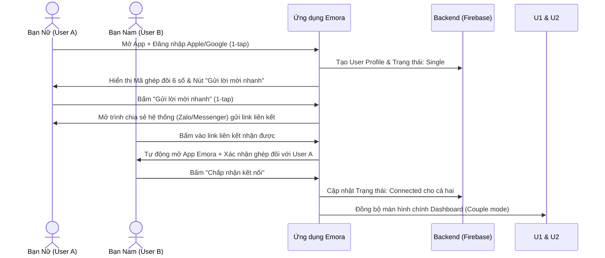
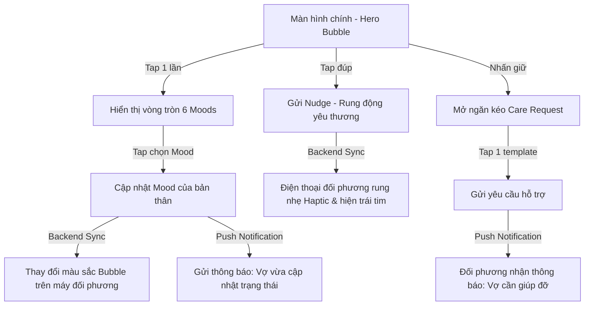
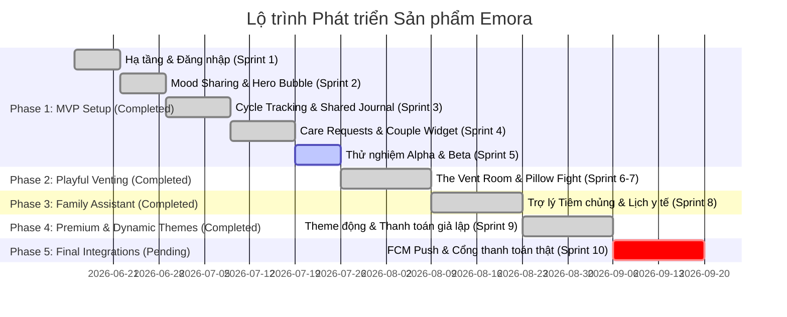

# BUSINESS REQUIREMENT DOCUMENT (BRD) - EMORA
**Phiên bản:** 1.0 (Final Draft)  
**Tác giả:** Senior Business Analyst & Product Manager  
**Ngày lập:** 11/06/2026  
**Dự án:** Emora - Ứng dụng Kết nối và Thấu hiểu Cặp đôi  

---

## 1. Product Vision (Tầm nhìn Sản phẩm)

### 1.1 Slogan
**"Understand Without Words" (Thấu hiểu không cần lời nói)**

### 1.2 Tầm nhìn
Emora hướng tới việc trở thành một không gian số riêng tư, tinh tế và không áp lực dành riêng cho các cặp đôi. Bằng cách loại bỏ những rào cản và áp lực trong việc giao tiếp hàng ngày, Emora giúp các cặp đôi dễ dàng chia sẻ trạng thái cảm xúc, nhu cầu cá nhân, và theo dõi sức khỏe sinh sản chỉ qua những tương tác một chạm (1-tap interaction). 

Sản phẩm định vị là một **"Người trợ lý thầm lặng"**, giúp nuôi dưỡng tình cảm từ những cử chỉ nhỏ nhất mà không tạo cảm giác kiểm soát hay làm phiền đối phương.

---

## 2. Product Goals (Mục tiêu Sản phẩm)

### 2.1 Mục tiêu Kinh doanh & Vận hành
*   **Chi phí vận hành tối thiểu:** Thiết kế kiến trúc tối giản, tận dụng tối đa hạ tầng Serverless để đạt chi phí vận hành nền tảng gần như bằng $0 trong giai đoạn đầu.
*   **Tốc độ đưa ra thị trường (Time-to-Market):** Phát triển nhanh phiên bản MVP trong vòng 6 - 8 tuần nhằm thử nghiệm mức độ đón nhận của thị trường.
*   **Cơ sở cho việc Premium hóa:** Xây dựng nền tảng vững chắc để tích hợp các gói tính năng cao cấp (Premium) ở các giai đoạn sau.

### 2.2 Mục tiêu Trải nghiệm Người dùng
*   **Tương tác không áp lực (Low-friction communication):** Người dùng có thể biểu đạt cảm xúc và nhu cầu của mình mà không cần phải suy nghĩ câu chữ hay nhắn tin dài dòng.
*   **Xây dựng thói quen hàng ngày (Daily Habit Loop):** Trở thành ứng dụng mở ra đầu tiên và cuối cùng trong ngày để cập nhật trạng thái với đối phương thông qua Widget hoặc màn hình chính.

---

## 3. Target Users (Đối tượng Người dùng)

Hệ thống phân rã thành 3 nhóm đối tượng mục tiêu với các nhu cầu cốt lõi khác nhau:

### 3.1 Nhóm 1: Các Cặp đôi Đang Yêu (Lovers) - Độ tuổi: 22 - 35
*   **Hành vi:** Có nhu cầu tương tác cao, muốn cập nhật tình trạng của nhau thường xuyên nhưng sợ làm phiền hoặc tạo cảm giác kiểm soát.
*   **Nỗi đau (Pain points):** Đôi khi không biết đối phương đang bận hay rảnh, mệt mỏi hay vui vẻ để nhắn tin phù hợp; ngại ngùng khi đòi hỏi sự quan tâm.
*   **Nhu cầu:** Cần một phương thức kết nối nhẹ nhàng, tinh tế và vui vẻ.

### 3.2 Nhóm 2: Vợ chồng Trẻ (Married Couples) - Độ tuổi: 25 - 40
*   **Hành vi:** Đã về chung một nhà, bắt đầu đối mặt với các vấn đề sinh hoạt thường ngày và kế hoạch hóa gia đình.
*   **Nỗi đau (Pain points):** Quên chia sẻ lịch trình cá nhân; việc giao tiếp về chu kỳ kinh nguyệt hoặc kế hoạch sinh con còn e ngại hoặc không tiện nói trực tiếp; phân chia việc nhà dễ gây xung đột nhỏ.
*   **Nhu cầu:** Theo dõi sức khỏe sinh sản, đồng bộ lịch sinh hoạt, giao tiếp nhanh các việc cần hỗ trợ một cách tinh tế.

### 3.3 Nhóm 3: Mẹ Bỉm Sữa & Chồng (Nursing Mothers & Partners) - Độ tuổi: 25 - 40
*   **Hành vi:** Trọng tâm chuyển sang chăm sóc em bé sơ sinh, người mẹ dễ rơi vào trạng thái mệt mỏi, quá tải (Postpartum stress).
*   **Nỗi đau (Pain points):** Người mẹ quá mệt để nhắn tin giải thích chi tiết cần chồng giúp gì; người chồng muốn giúp nhưng không biết bắt đầu từ đâu và dễ làm sai ý.
*   **Nhu cầu:** Yêu cầu hỗ trợ nhanh (1-tap Care Request), cập nhật trạng thái kiệt sức để chồng biết đường chủ động hỗ trợ, theo dõi lịch y tế/tiêm chủng của con.

---

## 4. Core Value Proposition (Giá trị Cốt lõi)

1.  **Cảm nhận không lời (Ambient Awareness):** Luôn biết được tâm trạng và năng lượng của đối phương thông qua thay đổi visual trên màn hình chính (Hero Bubble) mà không cần hỏi "Hôm nay thế nào?".
2.  **Chủ động sẻ chia, tôn trọng riêng tư (Privacy & Empathetic Sharing):** Cho phép bạn nữ tự cấu hình mức độ chia sẻ dữ liệu chu kỳ kinh nguyệt (Toàn bộ, Một phần, hoặc Không chia sẻ) để bạn nam có thể chuẩn bị tâm lý chủ động chăm sóc (nhất là trong giai đoạn PMS).
3.  **Hỗ trợ không ma sát (Frictionless Support):** Thay vì soạn tin nhắn, người dùng gửi yêu cầu giúp đỡ bằng các template thiết kế sẵn (Bring a Drink, Baby Care, Need a Hug) chỉ với 1-tap.
4.  **Lưu giữ khoảnh khắc thầm lặng (Implicit Journaling):** Ghi chép lịch sử sức khỏe sinh sản và các tương tác quan trọng một cách tự nhiên, tự động đồng bộ hóa.

---

## 5. Functional Requirements (Yêu cầu Chức năng)

Dưới đây là bảng đánh giá chi tiết từng chức năng từ bản thảo PRD, kèm đề xuất giữ lại, đơn giản hóa hoặc dời sang Phase sau dựa trên tiêu chí **Tối ưu MVP, Giảm chi phí vận hành và Nâng cao trải nghiệm một chạm**.

### 5.1 Bảng đánh giá và Phân bổ Chức năng (Feature Evaluation Matrix)

| STT | Tính năng | Giá trị Người dùng | Độ phức tạp | Tác động UX | Đề xuất phân bổ | Giải pháp đơn giản hóa / Tối ưu hóa |
| :--- | :--- | :--- | :--- | :--- | :--- | :--- |
| 1 | **Couple Connection** | Rất cao | Thấp | Trung bình | **Giữ lại (MVP)** | Đăng nhập Google/Apple. Ghép đôi bằng Mã 6 số. Bổ sung nút Share Link mời nhanh qua Zalo/Messenger chỉ với 1 chạm. |
| 2 | **Mood Sharing** | Rất cao | Thấp | Rất cao | **Giữ lại (MVP)** | Rút gọn danh sách còn 6 trạng thái cốt lõi kèm biểu tượng trực quan. Cho phép đổi nhanh ngay tại Hero Bubble trên Dashboard. |
| 3 | **Cycle Tracking** | Rất cao | Trung bình | Rất cao | **Tối ưu hóa (MVP)** | Bạn nữ nhập ngày bắt đầu/kết thúc trên lịch phẳng trực quan. Hệ thống tự động tính ngày rụng trứng/thụ thai. Chỉ gửi hiển thị trạng thái tổng quát (PMS, Period...) cho bạn nam. |
| 4 | **Shared Journal** | Trung bình | Trung bình | Trung bình | **Đơn giản hóa (MVP)** | **Bỏ cơ chế xác nhận chéo "Pending-Confirm-Reject"**. Chuyển thành Nhật ký dùng chung tự động đồng bộ. Ai tạo hoặc chỉnh sửa thì bên kia nhận Notification thông báo (Audit log), loại bỏ sự gượng gạo hành chính. |
| 5 | **Care Requests** | Cao | Thấp | Cao | **Tối ưu hóa (MVP)** | Dùng danh sách 6 template cố định, thao tác gửi chỉ qua 1 lần nhấn từ Dashboard. Người nhận có thể bấm "Chấp nhận" và "Hoàn thành" trực tiếp từ notification. |
| 6 | **Hero Bubble (Dashboard)** | Rất cao | Trung bình | Rất cao | **Tối ưu hóa (MVP)** | Điểm chạm cốt lõi. Tích hợp cử chỉ cử động: Chạm nhẹ (Đổi mood), Nhấn đúp (Nudge/Gửi tín hiệu nhớ thương), Nhấn giữ (Mở bảng Care Request). |
| 7 | **The Vent Room (Phase 2)** | Cao | Trung bình | Cao | **Dời sang Phase 2** | Tạm hoãn ở Phase 1. Ở Phase 2, rebrand từ "Đấm avatar" sang **"Playful Venting"** (Gửi các tương tác ném gối, cù lét) để mang tính chất yêu thương, hài hước. |
| 8 | **Trợ lý tiêm chủng (Phase 3)** | Rất cao | Trung bình | Cao | **Dời sang Phase 3** | Tự động sinh lộ trình tiêm chủng từ ngày sinh của bé và đồng bộ sang thiết bị của chồng. Chưa làm ở MVP để giảm tải database ban đầu. |
| 9 | **Gói Premium (Phase 4)** | Trung bình | Trung bình | Thấp | **Dời sang Phase 4** | Không hiển thị quảng cáo; mở khóa tính năng The Vent Room & Care Requests không giới hạn; mở khóa các Theme động, bộ Icon cảm xúc và Widget đặc biệt dành riêng cho cặp đôi. |

---

### 5.2 Đề xuất Tính năng mới tăng tính gắn kết (Easy-to-Implement Engagement Features)

Để tăng tỉ lệ giữ chân người dùng (Retention Rate) mà không làm tăng chi phí hạ tầng hay độ phức tạp của code, chúng tôi đề xuất thêm 3 tính năng siêu nhỏ sau vào Phase 1:

1.  **Emora Couple Widget (Widget Thấu hiểu tức thì):**
    *   **Mô tả:** Widget tiện ích trên màn hình chính của iOS/Android giúp hiển thị nhanh thông tin trạng thái của đối phương mà không cần phải mở ứng dụng.
    *   **Ưu tiên hiển thị:** 
        *   **Mood hiện tại của đối phương:** Hiển thị dưới dạng một bong bóng màu sắc đặc trưng đại diện cho cảm xúc của đối phương (ví dụ: đỏ nhạt cho Bực mình, xanh dịu cho Bình yên).
        *   **Care Requests đang chờ xử lý:** Nếu đối phương đã gửi yêu cầu chăm sóc mà người dùng chưa hoàn thành, yêu cầu đó sẽ hiển thị nổi bật trên widget (ví dụ: *"🍲 Mua đồ ăn giúp em"*).
    *   **Đánh giá UX và Đề xuất hiển thị:**
        *   *Kích thước Small (2x2) - "Bong bóng Đối phương":* Tập trung vào visual. Hiển thị Avatar của đối phương cùng Emoji mood lớn. Phía dưới hiển thị Care Request quan trọng nhất đang chờ xử lý. Nếu không có yêu cầu nào, widget hiển thị một dòng trạng thái ấm áp mặc định (ví dụ: *"Đang bình yên"*).
        *   *Kích thước Medium (4x2) - "Bảng điều khiển Cặp đôi":* Chia đôi màn hình widget. Bên trái hiển thị Mood và chu kỳ của bạn nữ (nếu chia sẻ). Bên phải hiển thị danh sách các Care Requests đang chờ xử lý cùng với 1 nút bấm tắt để mở nhanh app và phản hồi.
        *   *Hành động 1 chạm:* Chạm vào widget sẽ mở trực tiếp ứng dụng tại đúng màn hình tương tác tương ứng (ví dụ: chạm vào Care Request trên widget sẽ mở ngay màn hình xác nhận hoàn thành công việc).
    *   **Kỹ thuật:** Sử dụng widget hệ sinh thái Native (WidgetKit trên iOS, AppWidget trên Android) kết hợp lưu cache local để đảm bảo widget hiển thị tức thì mà không hao pin, chỉ reload dữ liệu khi nhận được Push notification thay đổi trạng thái từ đối phương.

2.  **"Appreciation Shake" (Rung động yêu thương):**
    *   **Mô tả:** Tương tác vật lý không lời. Khi một người cầm điện thoại và lắc (Shake), điện thoại của đối phương sẽ rung nhẹ (Haptic Feedback) kèm theo hiệu ứng trái tim bay trên màn hình nếu họ đang mở app.
    *   **Giá trị:** Biểu đạt "Anh/Em đang nhớ bạn" một cách tức thì, không cần gõ chữ, tăng tương tác tự nhiên.
    *   **Kỹ thuật:** Lắng nghe cảm biến gia tốc thiết bị (Accelerometer) -> trigger push notification gửi tín hiệu qua Firebase Cloud Messaging (FCM).

---

## 6. Non-Functional Requirements (Yêu cầu Phi chức năng)

### 6.1 An toàn và Bảo mật Thông tin (Security & Privacy)
*   **Mã hóa dữ liệu nhạy cảm:** Mọi dữ liệu về chu kỳ kinh nguyệt và Shared Journal phải được lưu trữ an toàn. Dữ liệu trên đường truyền bắt buộc phải dùng giao thức HTTPS.
*   **Quyền riêng tư tuyệt đối (Privacy by Design):** Bạn nữ có quyền bật/tắt chia sẻ dữ liệu chu kỳ cho bạn nam bất kỳ lúc nào. Khi tắt, phía bạn nam sẽ nhận được trạng thái: *"Chế độ chia sẻ riêng tư được bật"*.
*   **Xóa tài khoản triệt để (GDPR compliance):** Khi người dùng chọn hủy kết nối và xóa tài khoản, toàn bộ dữ liệu liên quan của cặp đôi phải được xóa sạch khỏi cơ sở dữ liệu sau 30 ngày (nếu không khôi phục).

### 6.2 Độ trễ & Hiệu năng (Performance)
*   **Đồng bộ thời gian thực (Realtime Sync):** Việc thay đổi trạng thái Mood hoặc gửi Care Request phải được cập nhật sang thiết bị của đối phương với độ trễ dưới 2 giây nếu cả hai đang mở app.
*   **Push Notification nhanh chóng:** FCM push message phải được gửi đi và nhận được trên thiết bị của đối phương trong vòng dưới 5 giây.

### 6.3 Tối ưu hóa Chi phí Hạ tầng (Operational Cost Optimization)
*   **Zero baseline cost:** Trong giai đoạn thử nghiệm (dưới 10.000 người dùng hoạt động hàng tháng - MAU), chi phí thuê máy chủ và database phải xấp xỉ bằng $0.
*   **Hạ tầng Serverless:** Khuyến nghị thay thế NestJS + PostgreSQL chạy trên máy chủ AWS EC2 24/7 bằng kiến trúc Serverless (Firebase/Supabase):
    *   **Database:** Firestore (NoSQL) hoặc Supabase (PostgreSQL serverless) – cung cấp miễn phí tới hạn ngạch rất lớn. Cơ chế Realtime được hỗ trợ sẵn, không cần viết code quản lý phòng chat WebSocket phức tạp.
    *   **Authentication:** Firebase Auth (Hỗ trợ sẵn Google, Apple Sign-in miễn phí).
    *   **Cloud Functions:** Xử lý các tác vụ logic nặng (như tính toán chu kỳ kinh nguyệt) theo cơ chế On-demand (Chỉ chạy khi có request, tính phí theo mili-giây sử dụng, miễn phí 2 triệu lượt gọi/tháng).
    *   **Push Notification:** Firebase Cloud Messaging (FCM) hoàn toàn miễn phí.

---

## 7. MVP Scope (Phạm vi Phase 1)

### 7.1 Tính năng Có trong MVP (In Scope)
1.  **Đăng nhập & Ghép đôi:** Google/Apple Sign-In, tạo mã ghép đôi, chia sẻ link ghép đôi nhanh, hủy kết nối.
2.  **Bong bóng tương tác chính (Hero Bubble Dashboard):**
    *   Visual thay đổi theo Mood của đối phương.
    *   Thao tác cử chỉ: Chạm 1 lần để đổi Mood của mình; Nhấn giữ mở bảng Care Requests; Nhấn đúp gửi Nudge (Appreciation Shake).
3.  **Chia sẻ tâm trạng (Mood Sharing):** 6 trạng thái cơ bản (Vui vẻ, Bình yên, Mệt mỏi, Buồn bã, Bực mình, Cần quan tâm) kèm push notification realtime.
4.  **Theo dõi chu kỳ cơ bản (Cycle Tracking):** Bạn nữ nhập lịch hành kinh; hệ thống dự báo chu kỳ tiếp theo và cửa sổ thụ thai; chia sẻ trạng thái chu kỳ vĩ mô (PMS, Kỳ kinh, Bình thường) cho bạn nam.
5.  **Nhật ký hành vi sức khỏe dùng chung (Shared Journal):** Ghi chép lịch sử quan hệ (An toàn / Không an toàn) trực tiếp trên Calendar mà không cần phê duyệt rườm rà. Gửi thông báo thay đổi cho người kia.
6.  **Yêu cầu chăm sóc (Care Requests):** Gửi 6 template yêu cầu cơ bản trong 1-tap, hỗ trợ phản hồi trạng thái Nhận việc / Hoàn thành việc nhanh từ thông báo đẩy.
7.  **Emora Couple Widget:** Hiển thị Mood và các Care Requests đang chờ xử lý của đối phương trực tiếp trên màn hình chính.

### 7.2 Tính năng Hoãn lại (Delayed to Phase 5 / Phase sau)
1.  **FCM Push Notifications (Dời sang Phase 5):** Tính năng gửi thông báo đẩy qua Firebase khi ứng dụng bị tắt.
2.  **Cổng thanh toán thật (Real In-App Purchase Billing - Dời sang Phase 5):** Tích hợp Google Play Billing / App Store Billing thực tế thông qua SDK RevenueCat.
3.  **"Love Note Wheel" (Vòng quay ngọt ngào - Hoãn lại sau MVP):** Bánh xe vuốt chọn nhanh 8 lời khen ngợi/cảm ơn siêu ngắn để gửi cho đối phương.

*(Lưu ý: Các tính năng thuộc Phase 2, 3, 4 ban đầu trì hoãn đã được hoàn thành đầy đủ ở các đợt cập nhật trước).*

### 7.3 Không thuộc phạm vi dự án (Out of Scope)
*   Phân tích tâm trạng bằng AI (AI Mood Analysis).
*   Gợi ý sức khỏe thông minh bằng AI (AI Health Insight).
*   Tính năng tính điểm chăm sóc (Care Score) nhằm tránh tạo áp lực thi đua độc hại trong tình cảm.
*   Theo dõi thai kỳ chi tiết tuần tự (Pregnancy Tracking) - sẽ định vị làm một app riêng nếu có nhu cầu.

---

## 8. User Flows (Luồng Trải nghiệm Người dùng Tối ưu)

### 8.1 Luồng Đăng nhập & Ghép đôi (Onboarding & Pairing Flow)

### 8.2 Luồng Cập nhật Mood & Gửi Nudge qua Hero Bubble

---

## 9. Success Metrics (Chỉ số Đo lường Thành công)

Để đánh giá mức độ hiệu quả của sản phẩm sau khi ra mắt phiên bản MVP, các chỉ số sau sẽ được theo dõi chặt chẽ:

*   **Chỉ số Tăng trưởng (Growth Metrics):**
    *   **Couples Paired:** Số lượng cặp đôi ghép đôi thành công và duy trì trạng thái kết nối. Mục tiêu MVP: >= 50 cặp đôi sử dụng thực tế.
*   **Chỉ số Tương tác (Engagement Metrics):**
    *   **Mood Updates per Week:** Số lần cập nhật tâm trạng trung bình của một cặp đôi trong tuần. Mục tiêu: >= 7 lần/tuần (trung bình mỗi người cập nhật 1 lần/ngày).
    *   **Care Request Completion Rate:** Tỷ lệ các yêu cầu hỗ trợ được đối phương ấn "Chấp nhận" và "Hoàn thành". Mục tiêu: >= 70% tổng số yêu cầu được gửi.
    *   **Widget Engagement Rate:** Tỷ lệ người dùng tương tác thông qua widget (chạm mở ứng dụng qua widget).
*   **Chỉ số Giữ chân (Retention Metrics):**
    *   **D7 Retention:** Tỷ lệ cặp đôi mở app sau 7 ngày kể từ lúc ghép đôi. Mục tiêu: >= 30%.
    *   **D30 Retention:** Tỷ lệ giữ chân sau 30 ngày. Mục tiêu: >= 15%.

---

## 10. Product Roadmap (Lộ trình Phát triển)

---

## 11. Kết luận và Khuyến nghị của Business Analyst

### 11.1 Đề xuất MVP Ưu tiên
MVP đề xuất của Emora tập trung tối đa vào **sự tối giản và tính tương tác không lời**. Việc cắt giảm cơ chế kiểm tra chéo phức tạp ở tính năng Nhật ký dùng chung và dời tính năng trợ lý tiêm chủng sang Phase 3 giúp giảm đáng kể rủi ro về mặt kỹ thuật và thời gian hoàn thành.

**Các tính năng ưu tiên phát triển trước:**
1.  Trải nghiệm tương tác với **Hero Bubble** (Tap, Double tap, Long press).
2.  Đồng bộ hóa **Mood Sharing** thời gian thực.
3.  **Cycle Tracking** cơ bản với thiết lập bảo mật tùy chỉnh cho nữ giới.

### 11.2 Các Rủi ro Sản phẩm cần lưu ý (Product Risks)

1.  **Rủi ro về Tương tác Một chiều (One-sided Engagement):**
    *   *Mô tả:* Một người (thường là bạn nữ) tích cực sử dụng app, trong khi người kia (thường là bạn nam) lười mở app hoặc tắt thông báo, dẫn đến việc mất kết nối cảm xúc kỹ thuật số.
    *   **Giải pháp:** Tận dụng tối đa **Widget trên màn hình chính** (Couple Widget) và thông báo đẩy có thể tương tác nhanh (Actionable Push Notifications) giúp bạn nam phản hồi ngay trên màn hình khóa mà không cần mở app.

2.  **Rủi ro Rò rỉ Dữ liệu Nhạy cảm (Data Privacy Risk):**
    *   *Mô tả:* Các dữ liệu về chu kỳ kinh nguyệt và lịch sử quan hệ tình dục là cực kỳ riêng tư. Mọi sự cố rò rỉ dữ liệu sẽ làm hỏng hoàn toàn uy tín thương hiệu.
    *   **Giải pháp:** Mã hóa dữ liệu trong database, sử dụng các tiêu chuẩn bảo mật của Firebase Auth và không thu thập thông tin danh tính thật nếu không cần thiết (không cần điền họ tên thật, số điện thoại, chỉ cần email đăng nhập ẩn danh).

3.  **Rủi ro Chi phí Vận hành (Cost Risk):**
    *   *Mô tả:* Nếu sử dụng AWS EC2 và RDS ngay từ đầu, dự án sẽ chịu chi phí duy trì cố định hàng tháng dù chưa có doanh thu.
    *   *Giải pháp:* Bắt buộc áp dụng **Kiến trúc Serverless** (Firebase Spark Plan/Supabase Free Tier) cho đến khi sản phẩm đạt điểm hòa vốn hoặc có lượng DAU lớn ổn định.

### 11.3 Định vị Sản phẩm Phù hợp nhất
Emora không phải là một ứng dụng chat (như Messenger, Zalo) hay một ứng dụng theo dõi chu kỳ kinh nguyệt đơn thuần (như Flo, Clue), cũng không phải là một công cụ quản lý công việc (Trello, Notion). 

Emora được định vị ở giao điểm của: **Cảm xúc - Sức khỏe sinh sản - Hỗ trợ hằng ngày**. Nó hoạt động như một **chất xúc tác thầm lặng** củng cố mối quan hệ bằng cách chuyển đổi những giao tiếp phức tạp thành những tín hiệu đơn giản, ấm áp và ý nghĩa.
